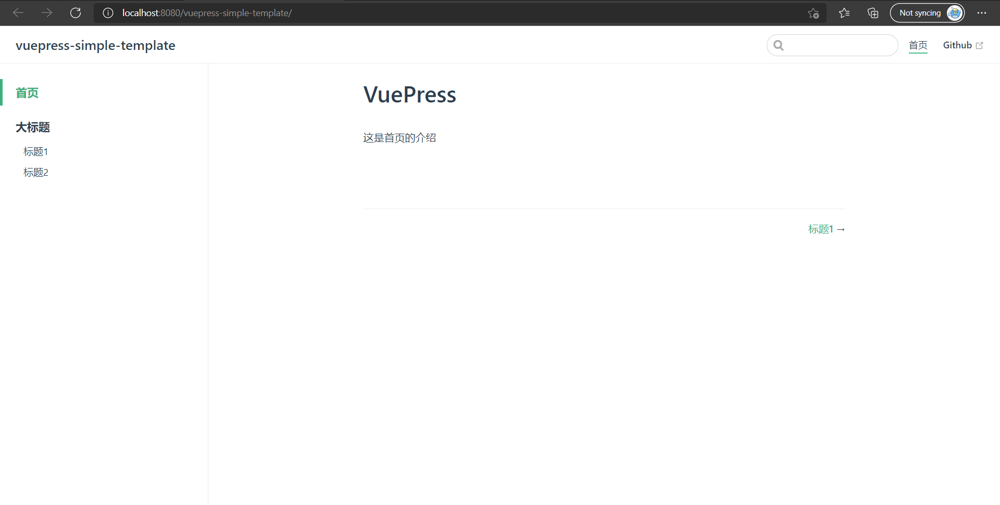
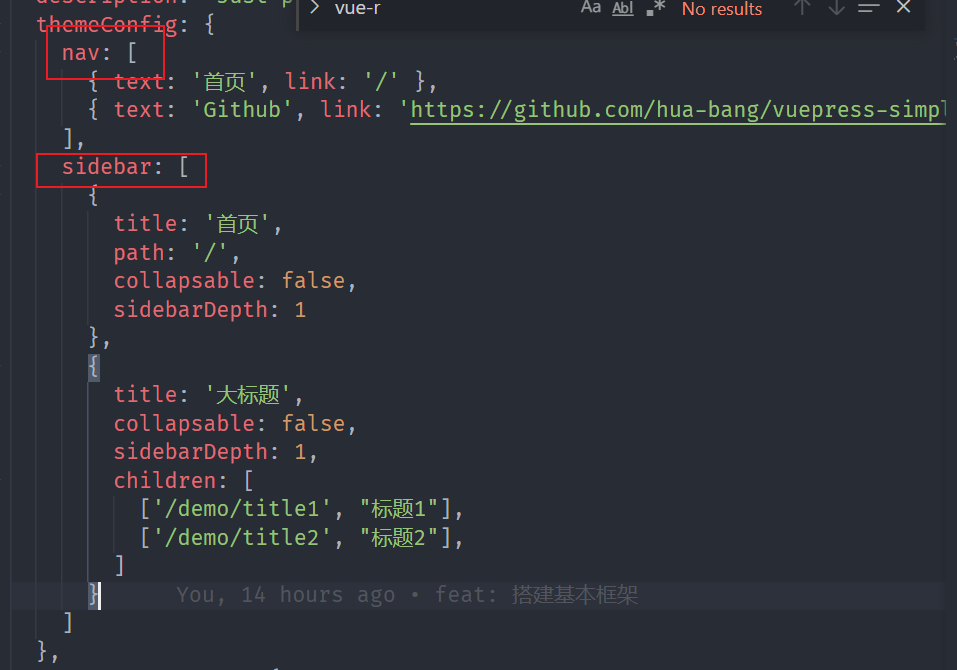
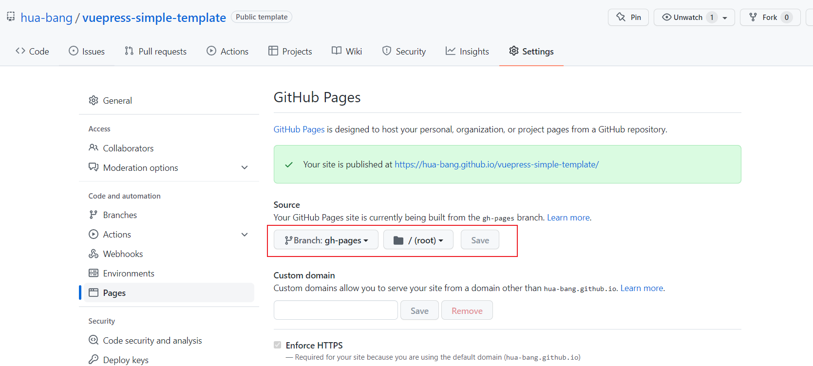
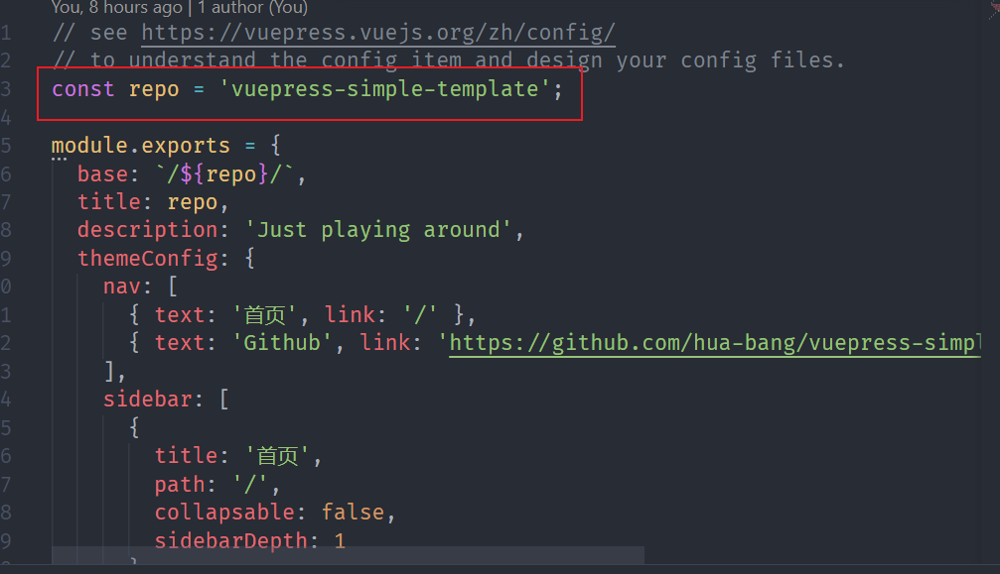

# vuepress-simple-template

>这是基于`vuepress`搭建的一个博客，仅仅是初始化了`vuepress`的侧边栏，以及顶部导航栏，仅作为**模板**。（并没有做复杂的封装，仅仅是模板）。

故该项目可参考[VuePress](https://vuepress.vuejs.org/zh/)做定制配置。

## 目录说明

```text
|-docs               // 文档资源
  |-.vuepress        // vuepress配置
    |-config.js      // vuepress配置文件
  |-assert           // 静态资源
  |-demo             // demo页目录
|-.gitignore         // .gitignore
|-package-lock.json
|-package.json    
|-README.md
```

上方是项目的一个简单的目录，这里主要看`.vuepress`与`assert`文件夹。
- .vuepress 作为`vuepress`的配置文件
- assert 作为静态资源的存放

当然，你可以自定义你的目录结构。（参考[目录结构|VuePress](https://vuepress.vuejs.org/zh/guide/directory-structure.html#%E9%BB%98%E8%AE%A4%E7%9A%84%E9%A1%B5%E9%9D%A2%E8%B7%AF%E7%94%B1)）

## 如何使用

### 使用项目模板新建项目并克隆到本地
进入[项目地址](https://github.com/hua-bang/vuepress-simple-template),点击`use this template`, 可以通过这个模板新建自己的项目，并`clone`到本地开发。

### 安装`Node`环境 

去[Node官网](https://nodejs.org/zh-cn/)安装并配置好`环境变量`即可。（可参考[前端必会：安装node](https://juejin.cn/post/7009687795681722381)）

> VuePress 需要 Node.js (opens new window)>= 8.6

### 安装依赖
进入项目的根目录，使用`npm`安装相关依赖。
```shell
npm install
```

### 启动项目
我们也希望我们在编写文档的同时，看到预览效果，这个时候我们也通过`npm`就可以启动啦。
```shell
npm run docs:dev
```
启动之后，看到如下页面。



### 编译打包
最终我们的文件是需要被vuepress编译打包的，实质上整个过程即`markdown` -> `html`的过程，一样，我们也通过`npm`就可以处理。

```shell
npm run docs:build
```

## 如何修改

### 修改配置

你可以通过[VuePress配置](https://vuepress.vuejs.org/zh/config/#base)根据你个人喜好来修改配置。

同时，关于`侧边栏`和`顶部导航栏`的配置，你也可以根据[导航栏](https://vuepress.vuejs.org/zh/theme/default-theme-config.html#%E5%AF%BC%E8%88%AA%E6%A0%8F)和[侧边栏](https://vuepress.vuejs.org/zh/theme/default-theme-config.html#%E4%BE%A7%E8%BE%B9%E6%A0%8F)来进行配置。



### 如何新增/修改文档

文档的目录均在`docs`中，`新增/修改`的操作均在该目录中。

#### 修改

根据`.vuepress`中`config.js`中`themeConfig`中的`sidebar`配置，找到对应的页面，进行修改，保存即可。

#### 新增

新增文件的话，由于目前官方暂不支持自动生成侧边栏菜单的操作，所以目前仍得去修改`.vuepress`中`config.js`中`themeConfig`中的`sidebar`配置，进行新增。（后续会做相关优化）。

1. 在`docs`目录新增`demo2`文件夹，并新建`test.md`,文件写入下方内容。
```markdown
# test
```
2. 修改`.vuepress`中`config.js`中`themeConfig`中的`sidebar`配置。(可理解为进行文件路由的新增)
```js
sidebar: [
  {
    title: '首页',   
    path: '/',     
    collapsable: false, 
    sidebarDepth: 1
  },
  {
    title: '大标题',   
    collapsable: false, 
    sidebarDepth: 1,  
    children: [
      ['/demo/title1', "标题1"],
      ['/demo/title2', "标题2"],
    ]
  },
  {
    title: '测试标题',
    collapsable: false,
    sidebarDepth: 1,
    children: [
      ['/demo2/test', '测试标题1']
    ]
  }
]
```

注意：`vuepress`修改`config.js`是不会重新加载，这时候你得重新启动项目即可。
```shell
npm run docs:dev
```

这时候，你应该就能看到新增的页面文档了。

## 如何部署

> use github hooks & github page to deploy the docs project

项目集成了`github actions`, 你可以通过`.github/workflows/vue-press.yml`查看对应的脚本。

目前，当项目`master`分支`push`时候，会触发`github action`, 把产物打包并推送到`gh-pages`分支。

此时，我们再去配置`Github Page`, 指定为`gh-pages`分支的根目录即可。



> Tip: 由于项目采用了`vue-router`，所以在打包过程中，我们需要去修改`docs/.vuepress/config.js`中`base`配置。由于本身做了相关配置，所以你只需要将`config.js`中`repo`改为你项目的名称即可。（更多配置请参考[base](https://vuepress.vuejs.org/zh/config/#base)）



## Q & A
该项目仅仅做为一个简易的模板，可能说明文档还不够详细，请见谅。同时，你可以通过[issues](https://github.com/hua-bang/vuepress-simple-template/issues)进行反馈。

You can custom this project by the [docs](https://vuepress.vuejs.org/zh/). 